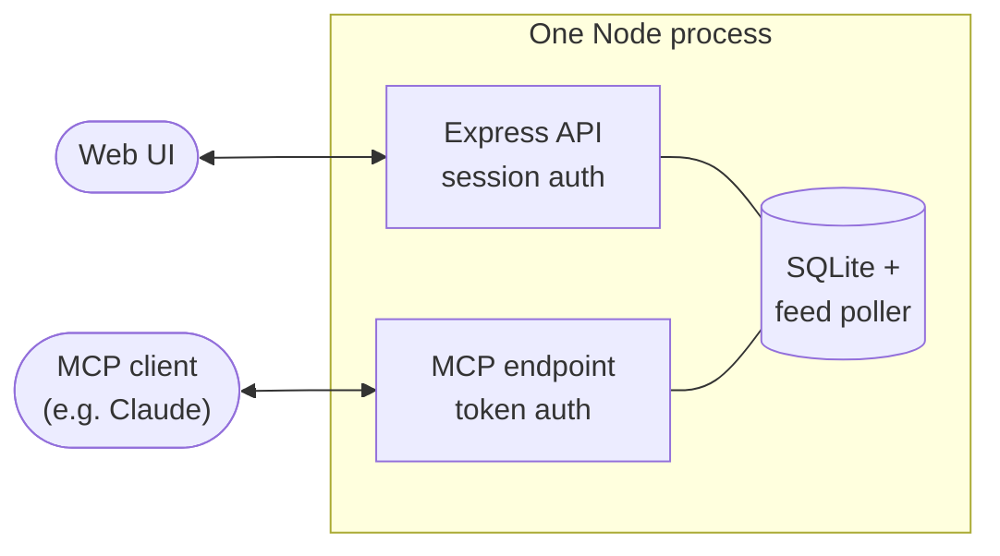

# FeedKeeper

<p align="center">
  <strong>A lightweight, self-hosted RSS reader and remote MCP server for your news, blogs, and AI workflows.</strong>
</p>

<p align="center">
  <a href="https://github.com/visualfusion/feedkeeper/actions/workflows/ci.yml"></a>
  <a href="LICENSE"></a>
  <a href="https://modelcontextprotocol.io"></a>
  <a href="#features"></a>
  <a href="#contributing"></a>
</p>

<br />

FeedKeeper is an independent RSS and Atom feed manager built for people who want full ownership over their subscriptions. It runs quietly on your own server or Raspberry Pi, stores everything in a local SQLite database, and requires zero cloud accounts.

Beyond a clean web reader, FeedKeeper includes a native, authenticated **[Model Context Protocol (MCP)](https://modelcontextprotocol.io)** endpoint. This lets MCP clients read, search, bookmark, and organize your feeds over a remote connection. Your subscriptions and reading history stay in your own SQLite database.

It is multi-user by default, with isolated accounts, personal access tokens, and a trilingual interface (English, German, and Japanese).

## Features

- **Folder organization and feed ordering** — group subscriptions into folders, move feeds between them, and reorder the feed list by dragging.
- **Smart feed discovery** — paste a direct feed link or a website address (like `example.com/blog`); FeedKeeper discovers RSS and Atom feeds.
- **Automatic character encoding** — parses standard UTF-8 as well as legacy ISO-8859-1/Windows-1252 feeds without garbled umlauts or broken symbols.
- **Bookmarks & Saved stories** — star interesting articles to read later; bookmarked items are permanently protected from automated cleanups.
- **Keyword mute filters** — cut through information overload by filtering out articles matching specific keywords before they reach your stream.
- **Health monitoring** — clear status indicators show polling health, consecutive fetch errors, and timestamps so you instantly spot dead feeds.
- **Automated database housekeeping** — sensible defaults prune read articles, enforce maximum item retention, and run SQLite `VACUUM` on schedule to keep storage lean.
- **Remote MCP access** — stream items directly into Claude or any MCP-compatible environment via standard Streamable HTTP.
- **Privacy & self-hosting first** — a single Node.js process and one SQLite file. No external database engines, no telemetry, no tracking.
- **OPML 2.0 import & export** — switch back and forth from Feedly, NetNewsWire, Inoreader, or Reeder at any time.
- **Article reader** — read feed content in the app, optionally fetch the full article on demand, and browse with keyboard controls.
- **Mobile-friendly web app** — responsive interface, mobile tab navigation, installable home-screen app, quick mark-as-read toggles, and dark/light modes.
- **Hardened security** — SSRF protection against internal network probing, rate limiting on authentication, and hashed API tokens.

## How it fits together



One Node process serves the built web UI, a REST API, and an MCP endpoint (`/mcp`, using the [Streamable HTTP transport](https://modelcontextprotocol.io/docs/concepts/transports)) — all backed by the same SQLite database and feed poller.

## Quick start with Docker

The fastest way to run FeedKeeper:

```bash
git clone https://github.com/visualfusion/feedkeeper.git
cd feedkeeper
cp .env.example .env
```

Generate a secret with `openssl rand -hex 32` and put it in `.env` as `SESSION_SECRET`. For a public domain, also set `PUBLIC_URL` to the URL users open. Then start the container:

```bash
docker compose up -d --build
```

Open `PUBLIC_URL` (by default `http://localhost:3000`) to complete the initial setup via the web onboarding screen.

Existing Docker installations must provide `SESSION_SECRET` through `.env` or the shell before using this Compose configuration. Changing it signs out active browser sessions; feeds and accounts stay in the database.

## Back up and restore

Create a consistent SQLite backup while FeedKeeper is running:

```bash
npm run db:backup -- /safe/location/feedkeeper.sqlite
```

The command refuses to overwrite an existing backup and verifies its integrity. Keep the backup outside the application directory and copy it to another machine or storage device.

With Docker Compose, create the backup in the mounted data volume and copy it to the host:

```bash
docker compose exec feedkeeper npm run db:backup -- /app/data/feedkeeper-backup.sqlite
docker compose cp feedkeeper:/app/data/feedkeeper-backup.sqlite ./feedkeeper-backup.sqlite
```

To restore, **stop FeedKeeper first**, then run:

```bash
npm run db:restore -- /safe/location/feedkeeper.sqlite --force
```

Restoring replaces the configured database. Start FeedKeeper again after the command succeeds. Existing backups may need a database migration on startup if they were created with an older version.

For Docker Compose, stop the service and run the restore command in a one-off container with the backup mounted read-only:

```bash
docker compose stop feedkeeper
docker compose run --rm --no-deps -v "$PWD/feedkeeper-backup.sqlite:/restore.sqlite:ro" feedkeeper npm run db:restore -- /restore.sqlite --force
docker compose up -d feedkeeper
```

## Quick start (local development)

Requires Node.js 22.22.2+ (22.x), 24.15+ (24.x), or 26+.

```bash
git clone https://github.com/visualfusion/feedkeeper.git
cd feedkeeper
npm install
cp .env.example .env
# edit .env — at minimum, set SESSION_SECRET (see the comment in the file)
npm run dev:server   # terminal 1
npm run dev:web      # terminal 2
```

Open `http://localhost:5173` and follow the onboarding screen to create the first admin account. (Prefer the terminal? `npm run setup` does the same thing without a browser.)

## Deploying

See [docs/deployment-uberspace.md](docs/deployment-uberspace.md) for a step-by-step guide to running FeedKeeper on [Uberspace](https://uberspace.de). The same steps work on any Linux host with SSH access and a supported Node.js version.

For production, build once and run the compiled server:

```bash
npm run build
npm run start
```

## Connecting an MCP client

1. Log in to the FeedKeeper web UI and go to **Settings → Personal access tokens**.
2. Create a token and copy it immediately — it's only shown once. Choose **Read only** for clients that only need to browse articles; choose **Read and write** to let the client change feeds or reading state. Existing tokens retain their previous write access.
3. Add an MCP server entry pointing at `https://<your-domain>/mcp`, sending `Authorization: Bearer <token>` as a header.

Every tool call is scoped to the token's owner — a client can only see and manage that user's own feeds and items.

### Available MCP tools

| Tool | Description |
|---|---|
| `list_feeds` | List subscribed feeds with unread counts and health status |
| `subscribe_feed` | Subscribe to a feed URL or website URL (auto-discovering the feed) |
| `discover_feeds` | Discover available RSS/Atom feeds on a website URL |
| `unsubscribe_feed` | Remove a subscription |
| `list_folders` | List folders with feed and unread counts |
| `create_folder` | Create a folder |
| `move_feed_to_folder` | Move a subscription into or out of a folder |
| `refresh_feed` | Force an immediate check/poll of a subscribed feed |
| `get_new_items` | Fetch unread items, optionally filtered by feed, search, or bookmarks |
| `list_items` | Page through compact items by time added; use cursors to fetch older or newly added items |
| `get_item` | Fetch one article and its cached content |
| `search_items` | Search titles and summaries across all items (with optional bookmarks filter) |
| `mark_read` | Mark an item as read |
| `mark_unread` | Mark an item as unread |
| `mark_all_read` | Mark all subscribed items as read, optionally within a feed or folder |
| `bookmark_item` | Save/bookmark an item for later reading |
| `unbookmark_item` | Remove bookmark from an item |
| `list_muted_keywords` | List user's active muted keywords |
| `add_muted_keyword` | Add a keyword to automatically filter out matching articles |
| `remove_muted_keyword` | Remove a muted keyword rule |
| `export_opml` | Export all subscribed feeds as an OPML 2.0 XML string |
| `import_opml` | Import feeds from an OPML 2.0 XML string |
| `cleanup_database` | *(Admin only)* Purge old items and reclaim disk space after deletions |

Read-only tokens expose only the tools that leave FeedKeeper data unchanged. `get_item` returns stored feed or reader content; it does not fetch the source website. For incremental synchronization, save `newestCursor`, pass it as `after` next time, and follow `nextCursor` as `before` until there are no more pages.

## Security

- **Closed signup by default** (`ALLOW_SIGNUP=false`). An admin creates additional accounts from Settings.
- **SSRF protection**: feed URLs and redirects are checked before fetching and again when connecting. Private/internal addresses are blocked by default. On trusted instances that need local feeds, set `ALLOW_PRIVATE_FEEDS=true`.
- **Rate limiting** on login and the general API surface.
- **Personal access tokens** are stored as salted hashes, never in plaintext.
- **Per-user data isolation**: every query is scoped to the authenticated user; feeds are deduplicated by URL under the hood, but subscriptions, read state, and tokens are always per-user.

The browser loads article images and site favicons from their source websites. Opening a full article through the reader also fetches that page from the FeedKeeper server.

Found a security issue? Please open an issue on GitHub or reach out to the maintainer directly rather than filing a public report for anything sensitive.

## Configuration

See [.env.example](.env.example) for all available environment variables.

## Tech stack

- **Server**: Node.js, TypeScript, Express, better-sqlite3, `@modelcontextprotocol/sdk`
- **Web**: React, Vite, Tailwind CSS, react-i18next

## Contributing

Issues and pull requests are welcome. This is a young project — expect some rough edges.

## License

[MIT](LICENSE)

---

<p align="center">Built by <a href="https://www.visualfusion.de">visualfusion</a></p>
